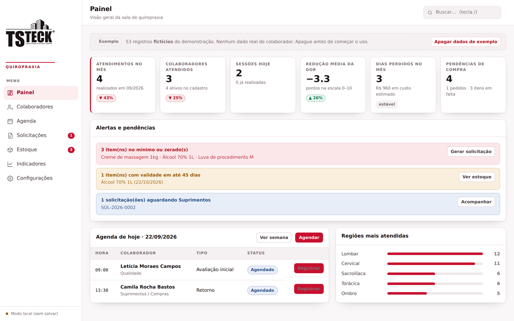
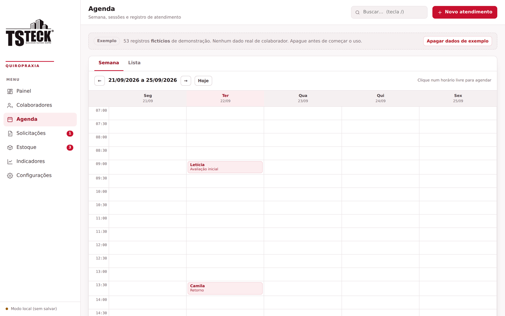
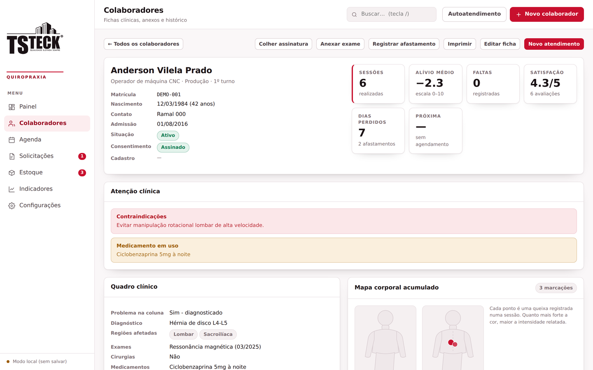
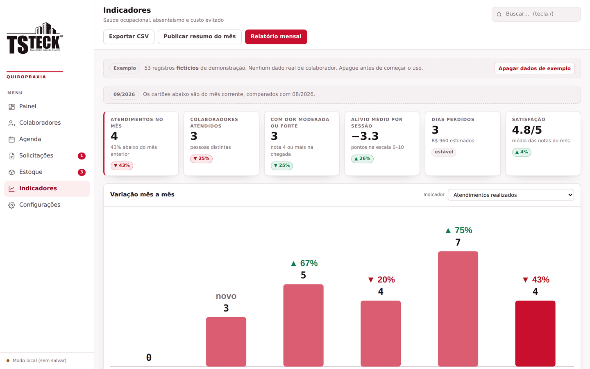
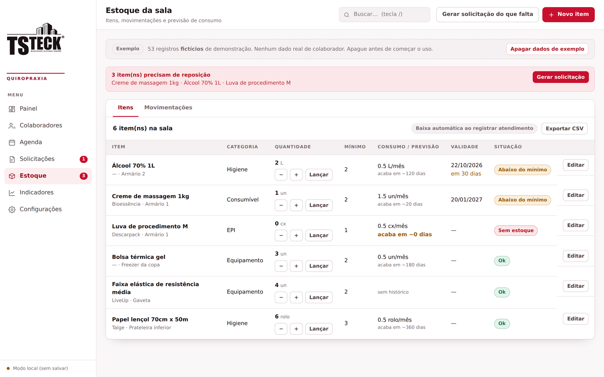

# Sistema da Sala de Quiropraxia — TS Teck

Sistema interno para a sala de quiropraxia da TS Teck: fichas clínicas dos colaboradores, agenda de atendimentos, solicitações de material ao setor de Suprimentos, controle de estoque da sala e indicadores de saúde ocupacional com relatório mensal em PDF.

Aplicação de **arquivo único** — HTML, CSS e JavaScript puro, sem framework, sem build, sem dependências de pacote. Abrir o `index.html` no navegador já executa o sistema inteiro.

> ### ⚠️ Repositório de demonstração
> Todos os dados exibidos aqui — nas capturas de tela, no relatório de exemplo e em `db/dados-exemplo.json` — são **fictícios**, criados apenas para mostrar o funcionamento do sistema. Nenhuma informação corresponde a colaborador real da TS Teck. O código da aplicação não contém dado algum: tudo vive no banco, que não faz parte deste repositório.
>
> Ficha clínica é dado pessoal sensível de saúde (LGPD, art. 11). **Dado real de colaborador nunca deve ser versionado**, nem em repositório privado.



---

## Sumário

- [Funcionalidades](#funcionalidades)
- [Como executar](#como-executar)
- [Telas](#telas)
- [Integração com banco de dados](#integração-com-banco-de-dados)
- [Níveis de acesso e LGPD](#níveis-de-acesso-e-lgpd)
- [Estrutura do repositório](#estrutura-do-repositório)
- [Documentação](#documentação)
- [Dados de demonstração](#dados-de-demonstração)
- [Autoria](#autoria)

---

## Funcionalidades

### Colaboradores
Ficha completa com dados cadastrais, setor, função e turno; avaliação da coluna com diagnóstico, regiões afetadas, exames e cirurgias; medicamentos em uso; contraindicações; perfil ergonômico do posto de trabalho; e liberação para atendimento. Anexo de laudos e atestados, termo de consentimento assinado na tela, mapa corporal acumulado e gráfico de evolução da dor ao longo das sessões.

### Agenda e atendimentos
Grade semanal com horários livres visíveis, bloqueio de conflito de horário e agendamento de séries de até 12 sessões semanais. No registro da sessão: queixa, mapa corporal clicável com três níveis de intensidade, escala de dor antes e depois, técnicas aplicadas, materiais utilizados, evolução, encaminhamento e avaliação do colaborador.

### Solicitações de compra
Pedido numerado automaticamente (`SOL-AAAA-0001`) com itens, justificativa e urgência. O setor de Suprimentos acompanha pelo fluxo Pendente → Aprovado → Comprado → Entregue, responde dentro do pedido e, ao marcar como entregue, pode lançar as quantidades direto no estoque.

### Estoque
Saldo, mínimo, validade e localização de cada item. Toda alteração gera movimentação registrada com autor e motivo. A partir do histórico o sistema calcula consumo médio e previsão de término, e monta sozinho a solicitação de reposição do que está em falta ou vai acabar em menos de 15 dias. Materiais usados num atendimento dão baixa automática.

### Indicadores e relatório
Variação percentual mês a mês em nove indicadores, com cor pelo sentido desejado de cada um — mais atendimentos é positivo, mais dor é negativo. Registro de afastamentos com dias perdidos e custo estimado, alerta ergonômico quando um mesmo setor concentra queixas na mesma região, e relatório mensal em A4 com resumo executivo escrito a partir dos dados, tabela comparativa, gráficos e linhas de assinatura.

[Exemplo do relatório gerado (PDF)](docs/exemplo-relatorio-mensal.pdf)

### Outros
Autoatendimento para o colaborador preencher a própria anamnese num tablet, exportação em CSV de todas as tabelas, backup completo em JSON, atalhos de teclado (`/` busca, `n` novo registro, `Esc` fecha) e layout responsivo até 400px.

---

## Como executar

```bash
git clone <url-do-repositorio>
cd quiropraxia-tsteck
```

Abra o `index.html` no navegador. É só isso — não há `npm install`, servidor ou etapa de build.

Nessa forma, os dados ficam gravados no `localStorage` do próprio navegador, através de um adaptador de persistência incluído para demonstração. Para uso real, esse adaptador é substituído pela API da empresa (veja a seção seguinte).

> Publicando o repositório no GitHub Pages, o `index.html` na raiz já serve como demonstração navegável.

---

## Telas

### Agenda semanal


### Ficha do colaborador


### Indicadores com variação mensal


### Estoque


---

## Integração com banco de dados

A aplicação **não conhece banco de dados**. Todo acesso a dados passa por um objeto único, `window.Sistema.servico(nome)`, que devolve quatro serviços: `db`, `user`, `downloads` e `assets`.

No `index.html`, logo no início do `<body>`, existe um bloco marcado como:

```
ADAPTADOR DE PERSISTÊNCIA — SUBSTITUIR PELA API DA TS TECK
```

São cerca de 60 linhas isoladas. **Trocar esse bloco é a única alteração necessária** para ligar o sistema à infraestrutura da empresa.

A aplicação chama exatamente três métodos de dados:

```js
db.collection(colecao).onSnapshot(next, erro)  // assinatura contínua
db.collection(colecao).doc(id).set(objeto)     // cria ou substitui
db.collection(colecao).doc(id).delete()        // remove
```

Mapeamento REST sugerido:

| Chamada | Endpoint |
|---|---|
| `onSnapshot` | `GET /api/{colecao}` (+ SSE, ou polling de 15–30s) |
| `set` | `PUT /api/{colecao}/{id}` |
| `delete` | `DELETE /api/{colecao}/{id}` |
| `user.me()` | `GET /api/me` |

Dois detalhes que costumam pegar quem integra:

- **Os ids são gerados no cliente** (base36 de timestamp + aleatório) e enviados no `set`. A API recebe o id pronto via `PUT`; não deve gerar o seu.
- `set` é **substituição total** do documento, não merge parcial.

O schema relacional proposto está em [`db/schema.sql`](db/schema.sql), com índices, views para os indicadores e uma alternativa simplificada em JSONB no final do arquivo — essa alternativa funciona sem alterar uma linha do front.

---

## Níveis de acesso e LGPD

O sistema trabalha com dois perfis, e a separação **precisa ser aplicada no servidor**, não apenas na interface:

| Perfil | Acessa |
|---|---|
| **Clínico** (`canEdit = true`) | tudo: fichas, agenda, anexos, estoque, compras, indicadores |
| **Operacional** (`canEdit = false`) | apenas solicitações de compra, estoque e os resumos mensais agregados |

As coleções `pacientes`, `atendimentos` e `afastamentos` contêm dado de saúde — sensível pelo art. 11 da LGPD — e **não devem sequer ser retornadas** pela API ao perfil operacional. A interface já se adapta sozinha ao perfil recebido.

Pontos a tratar na implantação: log de acesso a ficha (hoje só há log de escrita), política de retenção após o desligamento do colaborador e criptografia em repouso dos campos clínicos e dos anexos.

---

## Estrutura do repositório

```
.
├── index.html                      Aplicação completa, com adaptador de persistência
├── db/
│   ├── README.md                   Aviso sobre os dados e regra de versionamento
│   ├── schema.sql                  Schema PostgreSQL, com notas para MySQL
│   └── dados-exemplo.json          54 registros fictícios para homologação
├── docs/
│   ├── documentacao-tecnica.md     Contrato dos serviços, modelo de dados, checklist
│   ├── exemplo-relatorio-mensal.pdf
│   └── img/                        Capturas de tela
├── .gitignore
├── CHANGELOG.md
├── LICENSE
└── README.md
```

---

## Documentação

A [documentação técnica](docs/documentacao-tecnica.md) traz o contrato completo dos quatro serviços, o dicionário de campos das nove coleções, as onze automações que precisam ser preservadas no backend e um checklist de adaptação.

---

## Dados de demonstração

O conjunto em `db/dados-exemplo.json` traz 54 registros inventados: 4 colaboradores, 26 atendimentos distribuídos em cinco meses, 6 afastamentos, 6 itens de estoque, 8 movimentações e 2 solicitações de compra. É o que alimenta as capturas de tela acima e o [relatório de exemplo](docs/exemplo-relatorio-mensal.pdf).

As matrículas seguem o padrão `DEMO-000` e os ramais são `Ramal 000`, de propósito, para que o conjunto nunca seja confundido com dado de produção. Cada registro carrega `ficticio: true` e `exemplo: true`, e o sistema exibe um aviso permanente enquanto eles existirem, com um botão que apaga todos de uma vez.

Detalhes e a regra de versionamento estão em [`db/README.md`](db/README.md).

## Autoria

Desenvolvido por **Henrique Fernandez** — Suprimentos, TS Teck.

## Licença

Veja [LICENSE](LICENSE).
